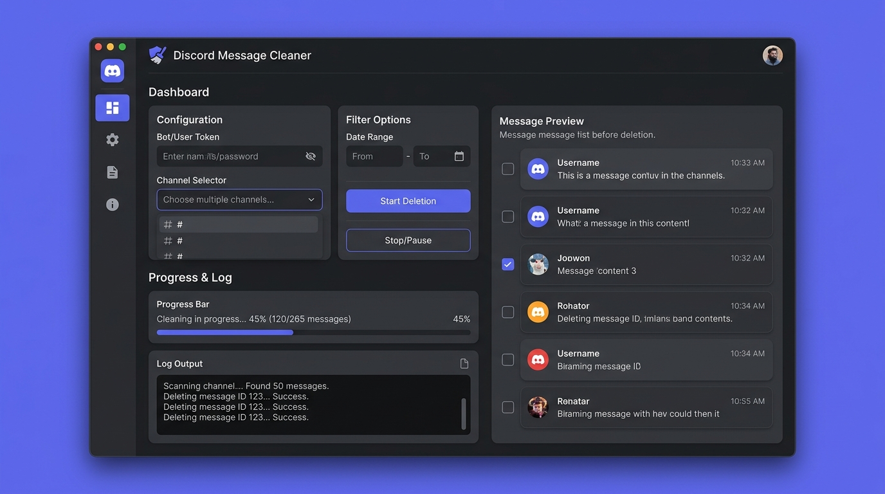

# ⚡ Discord Message Cleaner

<p align="center">
  
</p>

<p align="center">
  
  
  
  
</p>

**Discord Message Cleaner** es una aplicación de escritorio moderna, rápida y segura diseñada para buscar, previsualizar y eliminar en masa tus mensajes antiguos en cualquier canal o mensaje privado (DM) de Discord.

---

## ✨ Características Principales

- 🛡️ **Seguridad Total (Cifrado DPAPI)**: Tu token de Discord se almacena de forma segura en tu sistema utilizando `electron.safeStorage` (el mismo nivel de cifrado que usa Google Chrome o Windows DPAPI). Al cerrar la app, tus datos permanecen protegidos y no requieres volver a ingresar el token.
- 👁️ **Previsualización de Mensajes**: Escanea y revisa tus mensajes antes de borrarlos para evitar borrar información importante.
- 🎯 **Filtros Avanzados**:
  - Filtro por fecha (Desde / Hasta).
  - Filtro por palabras clave o contenido específico.
- ⚡ **Gestión Inteligente de Rate-Limits**: Implementación de temporizadores dinámicos con pausas automáticas para cumplir con las políticas de la API de Discord y prevenir baneos o bloqueos por límite de peticiones (429 Too Many Requests).
- 🎨 **Interfaz Estilo Discord**: Tema oscuro nativo, elegante, fluido y fácil de usar.
- 🚀 **Ejecutable Portátil**: No requiere instalación de Node.js ni Python. Descargas el archivo `.zip`, descomprimes y ejecutas.

---

## 📥 Descarga de la Release v0.0.1

Puedes descargar la versión ejecutable lista para usar directamente desde la sección de **Releases**:

👉 **[Descargar DiscordMessageCleaner.zip (v0.0.1)](https://github.com/ergitoesp/BorrarMensajesDiscord/releases/download/v0.0.1/DiscordMessageCleaner.zip)**

### 🚀 Instrucciones de Uso Rápido:
1. Descarga el archivo `DiscordMessageCleaner.zip`.
2. Extrae el contenido en cualquier carpeta de tu equipo.
3. Haz doble clic en `Discord Message Cleaner.exe`.
4. Ingresa tu **User ID** y **Token de Discord** (se guardarán cifrados automáticamente).
5. Agrega los ID de canal donde quieras borrar mensajes y presiona **Previsualizar** o **Iniciar Borrado**.

---

## 🔑 Cómo Obtener tu User ID y Token de Discord

> ⚠️ **IMPORTANTE DE SEGURIDAD**: Nunca compartas tu token con nadie. Quien tenga tu token tiene acceso a tu cuenta. Esta aplicación almacena tu token **únicamente de forma local en tu ordenador** utilizando cifrado de nivel de sistema operativo.

### 1️⃣ Obtener tu User ID:
1. En Discord, abre **Ajustes de Usuario** ⚙️ → **Avanzado**.
2. Activa el **Modo Desarrollador**.
3. Haz clic derecho sobre tu propio nombre o avatar en cualquier chat y selecciona **Copiar ID de usuario**.

### 2️⃣ Obtener tu Token de Discord:
1. Abre Discord en tu navegador web (Google Chrome, Edge, Brave, Firefox) o en la app de escritorio.
2. Presiona `Ctrl + Shift + I` (o `F12`) para abrir las **Herramientas de Desarrollador**.
3. Dirígete a la pestaña **Consola** (Console).
4. Pega el siguiente comando y presiona `Enter`:

```javascript
window.webpackChunkdiscord_app.push([[Math.random()],{},e=>{for(const c of Object.values(e.c))if(c?.exports?.default?.getToken!==void 0)return console.log("%cTu Token: %c" + c.exports.default.getToken(), "color:#5865F2;font-weight:bold;", "color:#00FF00;font-weight:bold;")// }]);
```

5. Copia el código que aparece resaltado en verde y pégalo en la aplicación.

---

## 💬 Cómo Obtener el ID de un Canal o Chat Privado (DM)

1. Con el **Modo Desarrollador** activado en Discord.
2. Haz clic derecho sobre el canal, grupo o chat privado de la persona.
3. Haz clic en **Copiar ID del canal**.
4. Pégalo en el campo **Channel ID** dentro de la app y presiona **+ Añadir**.

---

## 🛠️ Desarrollo y Compilación desde el Código Fuente

Si deseas ejecutar o compilar el proyecto manualmente desde el código fuente:

### Requisitos Previos:
- [Node.js](https://nodejs.org/) v18 o superior.
- Git.

### Pasos:

```bash
# 1. Clonar el repositorio
git clone https://github.com/ergitoesp/BorrarMensajesDiscord.git
cd BorrarMensajesDiscord

# 2. Instalar dependencias
npm install

# 3. Ejecutar en modo desarrollo
npm start

# 4. Compilar la versión empaquetada (Genera N_Codigo/DiscordMessageCleaner.zip)
npm run build
```

---

## 📁 Estructura del Proyecto

```
BorrarMensajesDiscord/
├── main.js             # Proceso principal de Electron e IPC (gestión de peticiones API y safeStorage)
├── preload.js          # Puente de contexto seguro (ContextBridge)
├── index.html          # Estructura de la interfaz gráfica
├── renderer/
│   └── app.js          # Lógica del cliente (paginación, escaneo, borrado y persistencia)
├── styles/
│   └── app.css         # Estilos visuales en CSS nativo (Estilo Discord)
├── docs/
│   └── images/         # Capturas de pantalla e imágenes para documentación
└── package.json        # Configuración del proyecto y scripts de empaquetado
```

---

## 🛡️ Descargo de Responsabilidad (Disclaimer)

Esta herramienta se proporciona únicamente con fines educativos y de gestión personal de datos. El usuario es responsable del uso de su token y del cumplimiento de los [Términos de Servicio de Discord](https://discord.com/terms).

---

<p align="center">Desarrollado con ❤️ usando Electron & JavaScript puro.</p>
